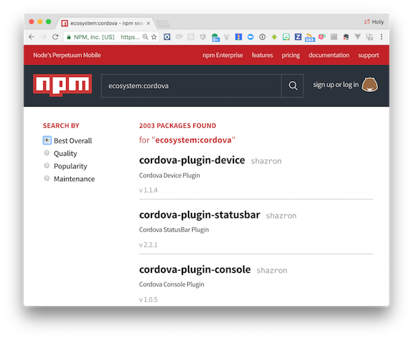

_approximate duration : 10 minutes_

<!--
for cordova-plugin-device, I showed the repo, then I explained the contents of plugin.xml
then I showed how each plugin.xml element mapped to an output project
then I explained how the device.js file was able to send/receive messages from the native layer via exec
then I created a new project, installed the plugin and step debugged the native parts in xcode
-->

## Plugin Discovery
Plugins are used to extend the native functionality exposed by the PhoneGap native-app container. Examples of plugins include those that allow to access the Camera, Battery Status, Push Notifications, Geolocation, 
Barcode Scanning, Native Social Sharing and many more. The [npm registry](http://nmpjs.org) is used to find plugins currently available to the community. You can discover the latest by searching `ecosystem:cordova`.

>Plugins may often be prefixed with a naming convention depending on the goal of the plugin. All of the core supported Cordova plugins are prefixed 
with `cordova-*`, while those specifically created by the PhoneGap team are prefixed with `phonegap-*`. Ionic has a [marketplace for Ionic specific Cordova plugins](https://market.ionic.io/plugins), with most of those
prefixed with `ionic-*`. Telerik also has a [plugin marketplace](http://plugins.telerik.com/cordova) to be aware of with their verified Cordova plugins that may or may not be found in the official npm plugin registry. 

<!--Demo using npm as a cordova plugin registry-->

### Exercise 1

Navigate to [npmjs.org](http://npmjs.org) and do your own search for Cordova plugins now to see what you can find. Does it look like the picture below? Scroll through and take a look at all of the different plugins already available. 

## Plugin Installation 
Plugins are added and removed using the [Cordova](https://www.npmjs.com/package/cordova-cli) or [PhoneGap CLI](https://www.npmjs.com/package/phonegap).

  - **Add a Plugin**

      - `$ phonegap plugin add cordova-plugin-device`
      - `$ cordova plugin add cordova-plugin-device`

  - **Remove a Plugin**

      - `$ phonegap plugin remove cordova-plugin-device`
      - `$ cordova plugin remove cordova-plugin-device`

  - **List all Plugins**

     - `$ phonegap plugin list`
     - `$ cordova plugin list`

>The platform specific plugin code will be copied into the target platform when a `prepare`, `build` or `run` command is specified using one of the CLI's. 
>If the plugin supports the `browser` platform, it will be copied to that target when the `phonegap serve` command is run. 

### Exercise 2

1. Create a simple plugin using an existing plugin's `plugin.xml` file as a resource (for instance cordova-plugin-device)
2. Add dependencies to two additional plugins
3. Add your new plugin to a PhoneGap or Cordova app project 

>Tip: You can use the --link flag when you add the plugin locally during developmet and Cordova will create a symbolic link to it. This way any source updates will automatically be available to your project. 

        `$ cordova plugin add --link ~/path/to/plugin`

>If you need to create a project first with the CLI, do so with the following commands, from the Cordova or PhoneGap CLI respectively: `$ cordova create myAppProject` or `$ phonegap create myAppProject`, then `cd` into `myAppProject` and run the plugin commands listed above.

<a href="index.html" class="btn btn-default"><i class="glyphicon glyphicon-chevron-left"></i> Previous</a>
<a href="lesson2.html" class="btn btn-default pull-right">Next <i class="glyphicon
glyphicon-chevron-right"></i></a>

