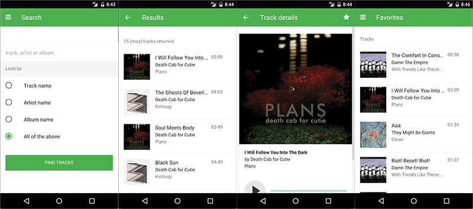

## Retrieve the Final Solution App
The final version of the project we'll be building in this workshop is located at [http://https://github.com/phonegap/workshop-plugins](https://https://github.com/phonegap/workshop-plugins).
Before moving forward we'll create a local project with it for reference. 

#### Steps
1. Create a working directory named `pgday2016` on your hard drive
2. From the command line, `cd` into it, then use the PhoneGap CLI with the following command to create a local version of the final project named `workshop-plugins`

        phonegap create workshop-plugins --template https://https://github.com/phonegap/workshop-plugins

   Alternatively you could use git to clone the project as well:

        git clone https://https://github.com/phonegap/workshop-plugins

2. At this point you should have a folder called `workshop-plugins` containing the copy of the final project in your working directory:

        ~/pgday2016/workshop-plugins

>This final project can be used for reference in case you get stuck at any point in the workshop or simply want to
follow along using it rather than code from your own version.

## Create a new Project
In this step we'll be using the [PhoneGap CLI](https://www.npmjs.com/package/phonegap) to create a project based on an existing PhoneGap app template called **Star Track**. We'll work through lessons enhancing
the base Star Track sample with some additional features. The final result should look like the project you retrieved in step 1 above.

>IMPORTANT: If you have not installed the PhoneGap CLI yet or do not have version 6.2.3 or greater, please install it now from npm:
  `npm install -g phonegap`. PhoneGap CLI 6.2.2 had a bug that could interfere with certain parts of this workshop so please ensure you're not using
that version. To check simply run the command `phonegap -v`.

1. `cd` back into the root of the working directory (`~/pgdayeu/`)

2. Create a new PhoneGap project using the PhoneGap CLI and passing the name of the starter *Star Track* PhoneGap template.

        phonegap create myStarTrack --template phonegap-app-star-track      

    The above command will create a basic project with a default name and id. If you would like to specifically set the name and id, use the following command with your desired parameters:

        phonegap create myStarTrack --template phonegap-app-star-track  --name "My Star Track" --id com.mycompany.startrack

3. By the end of this step you should have two folders in your working directory:

    - `~/pgday2016/workshop-plugins` - the final project for reference
    - `~/pgday2016/myStarTrack`         - the base star track app to enhance
    
>You can view the list of PhoneGap templates available by running `phonegap template list` from the 
PhoneGap CLI.     

## Run the base app
Before moving on, ensure your newly created Star Track app based on the template works since we will be building on this
throughout the workshop. Below is what it looks like running on Android with material design, and at the end of this section
are screenshots of what it looks like running on iOS.  
    
    

To try it out, choose from the following options:

- `Serve` your app and view it with the PhoneGap Developer App on a mobile device or in the browser (recommended approach).

   - **Serve with PhoneGap CLI**
     1. From the command line, first ensure you're in the root of your new project (`~pgday2016/myStarTrack`)
     2. Run `phonegap serve`
     3. Connect to the URL reported from the `serve` command in the PhoneGap Developer app on a mobile device (or in a browser using `localhost` and the port number from the command)

   - **Serve with PhoneGap Desktop**
     1. Locate where you created your **Star Track** project and add it to PhoneGap Desktop by clicking the **+** button and selecting *Open Existing Project* to choose it.
     2. Click the play **>** button if the project is not active
     3. Connect to the URL reported from PhoneGap Desktop in the PhoneGap Developer app on a mobile device

   > Using the option to `serve` your app with either of the options above allows you to use Live Reload functionality to view your code updates immediately without having to restart. If you see an **EADDRINUSE** error then you are still serving another project on the same port and need to stop it or simply the port number used. From the CLI you can
   specify it with the following: `phonegap serve --port 3001`. From the PhoneGap Desktop app you can modify it by clicking the Settings icon in the left panel.

- Open your app directly in the browser. Locate your project and simply open the `index.html` in a browser to try it out. This is not the desired approach as the features that require native plugins will not work and you may have XHR issues.

- **Advanced Option:** those with proper local setup can run on device/emulator with PhoneGap CLI with one of the following:

            $ phonegap run ios
            $ phonegap run ios --device
            $ phonegap run android             
            $ phonegap run android --device               

  >This option requires a mobile SDK setup. If you have Mac and Xcode you should be able to use iOS, but Android requires [additional SDK installation and setup](http://developer.android.com/sdk).

  **NOTE:** If you don't have the PhoneGap Developer App, you can still run the app in your browser by opening the `index.html` file in the browser, you will just have limited
  functionality.

- Spend a moment trying out the app, ensuring it looks like what you see below:

   

>You should use your browser developer tools at any time during this workshop to help debug any issues. In Chrome you can access them with **Alt+Cmd+I** or via the **View->Developer** menu.

### PhoneGap Developer App Tips
When viewing your apps with the PhoneGap Developer app, you should be aware of the following gestures:

- Use a *4 finger* tap to force your app to refresh
- Use a *3 finger* tap to go to the home screen

<a href="index.html" class="btn btn-default"><i class="glyphicon glyphicon-chevron-left"></i> Previous</a>
<a href="lesson2.html" class="btn btn-default pull-right">Next <i class="glyphicon
glyphicon-chevron-right"></i></a>

