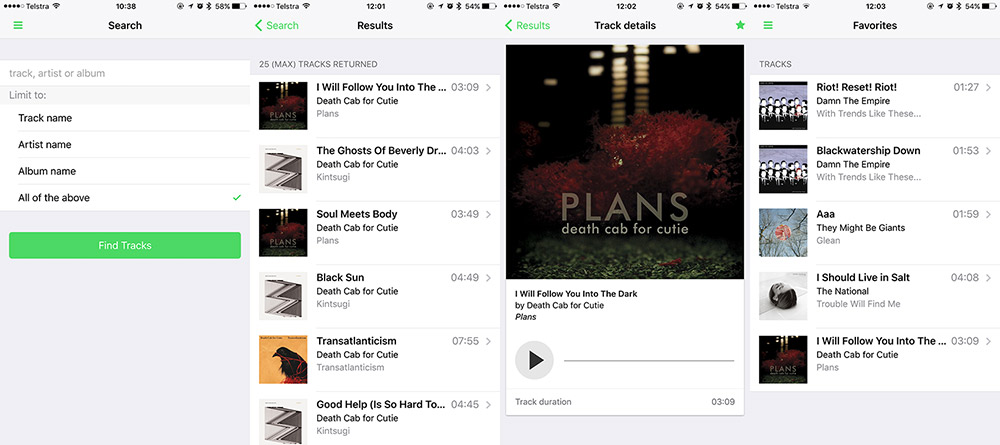

# Overview

_approximate duration : 15 minutes_

- npm as a cordova plugin registry
- cordova/phonegap tooling to add|remove|ls plugins
- a walk through the plugin.xml format
    - defining platform code
    - shared js code
    - id/name/version
    - dependencies
    - tools to use to create plugins, plugman, phonegap/phonegap-plugin-template
    - exercise, create a plugin using above tools, make it depend on 2 other plugins, install it
- what's next in plugin definition? package.json

## Cordova Plugin Registry

## Add/Remove Plugins with Tooling

## Plugin.xml

## Coming Soon... `package.json`

<!--
  **NOTE:** If you don't have the PhoneGap Developer App, you can still run the app in your browser by opening the `index.html` file in the browser, you will just have limited
  functionality.

- Spend a moment trying out the app, ensuring it looks like what you see below:

   

>You should use your browser developer tools at any time during this workshop to help debug any issues. In Chrome you can access them with **Alt+Cmd+I** or via the **View->Developer** menu.

### PhoneGap Developer App Tips
When viewing your apps with the PhoneGap Developer app, you should be aware of the following gestures:

- Use a *4 finger* tap to force your app to refresh
- Use a *3 finger* tap to go to the home screen

-->

<a href="index.html" class="btn btn-default"><i class="glyphicon glyphicon-chevron-left"></i> Previous</a>
<a href="lesson2.html" class="btn btn-default pull-right">Next <i class="glyphicon
glyphicon-chevron-right"></i></a>

