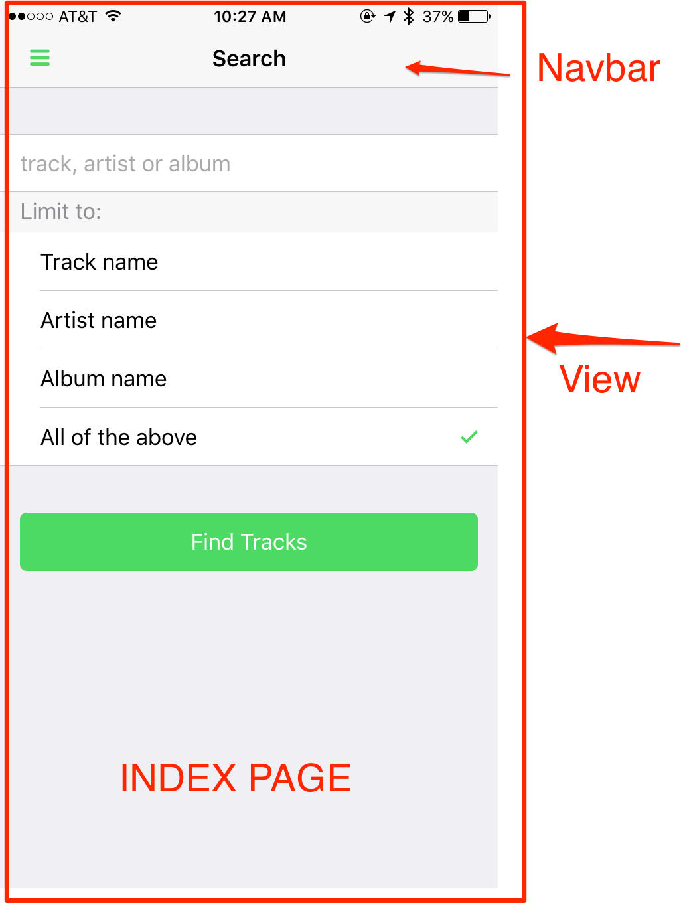

In this lesson we'll walk through the base Star Track app to learn how it works and look at some important pieces to be aware
of including a bit about some Framework7 components and settings specifically. Through this exercise we'll also gain an
understanding of how a [Single Page Application](guides/single-page-architecture.html) works.

>**A Single Page App** is an app that loads a single HTML page and dynamically updates that page as the user interacts with the app. 
SPAs use AJAX and HTML5 to create fluid and responsive Web apps without constant page reloads.
 <a href="https://msdn.microsoft.com/en-us/magazine/dn463786.aspx">Source</a> 

## Framework7 initialization
When you initialize your app in Framework7, there are various parameters you could specify depending on how you
want things to work in your app. Review the [docs here](http://framework7.io/docs/init-app.html) for all of the options available. 
In the Star Track app, the following are used and set in the `www/js/my-app.js` file:

    var myApp = new Framework7({
      material: isIos? false : true,       // activate material-specific
      template7Pages: true,                // enable Template7 rendering
      precompileTemplates: true,           // auto compile all templates
      swipePanel: 'left',                  // enable swipe for side panels
      swipePanelActiveArea: '30',          // Width to trigger swipe panel
      swipeBackPage: true,                 // Swipe back from left edge 
      animateNavBackIcon: true,            // Dynamic navbar icon animation
      pushState: !!Framework7.prototype.device.os,  //enable hash navigation in browser mode
    });

## Themes
Open the `www/index.html` and locate the `<body>` tag. You can give your app a new theme by modifying the `theme-green` class to another color. To find out which colors are supported, refer to the [Framework7 theme docs](http://framework7.io/docs/color-themes.html) for the platform you're testing on. If you're running it in the browser it will default to material using code set in the `www/js/init-styles.js`
file. For instance, you could choose purple if you're running with the material style:

    <body class="theme-purple">

Alternatively, two layout themes (white and dark) are also supported and affect the background and font colors. The default is white. Go ahead and apply the `layout-dark` class to the `<body>` tag now to see how it affects the app:

    <body class="layout-dark">

For this workshop, let's set it to a combination of the following to match the Spotify theme:

    <body class="layout-dark theme-green">

There are a couple more minor changes to make before moving on here due to the change for the dark theme. We need to modify the 
`www/css/styles.css` file to remove the background color specificlly set for iOS panel so the dark theme applies.
**Remove** the following style setting:

    .ios .panel {
      background-color: #ffffff;
    }
 
We'll also want to update the `statusbar-overlay` settings to use a dark background and white font for iOS. While in the `styles.css` file, 
comment out the current `statusbar-overlay` background settings and set it to black instead as shown below:

    /* Use for light background apps */
    /*.statusbar-overlay {
    /*  background: rgb(247, 247, 248);*/
    }*/

    /* Use for dark background apps */
    .statusbar-overlay {
      background: rgb(0, 0, 0);
    }

Lastly we'll need to open the `config.xml` file and comment out the `StatusBarStyle` preference since it's currently set for
to default which will use black font.  When the statusbar plugin is added it will be set to 
`lightcontent` by default which is white text and what we want in this case. Comment this out as shown below. 

    <!--<preference name="StatusBarStyle" value="default" />--> 
    
>The color themes will be applied a bit differently between platforms. You could also apply specific themes to sub-elements within the body as well, like page, view, navbar, list-block etc. Refer to [the docs](http://framework7.io/docs/color-themes.html) for more details on other classes that can be used to change the background color, font color and border color in their utility classes 
as well.      

## UI Structure

Single page applications are considered the best approach for hybrid app development. In a single page application, state changes occur via JavaScript using templates and DOM manipulation rather than making calls to a server to return an HTML page. The logic stays on the client side and routing and templates are used to manipulate views when actions occur. Numerous popular frameworks support this concept (Angular, Ember etc) and have it built-in to the framework. In those cases you will define your routes and templates as the framework prescribes.

- **Views** - The wrapper container for all visual views. Only one `views` element is allowed

- **View** - A separate visual part of app with its own settings, navigation and history. You must have a default view with class `view-main` since it's the default where all pages are loaded into.  

- **Pages** - A wrapper container for pages within a single view.

- **Page** - Similar to a web page, this is what we're transitioning between. There can be many pages within a single view.

- **Side Panel** - You can use up to 2 panels in an app, one on left side and another one on right side and they should be added to the beginning of the body tag. These panels are hidden initially and can be used
for a side menu. You can also specify an effect when the panel is shown by setting a class to either `panel-cover` or `panel-reveal`. Modify yours now, then try clicking the hamburger icon to 
trigger the panel to open to see the difference.

      

 

#### Views and Pages
Based on the above terminology, in our Star Track App we are using one **view** (stack of pages called main view) and we navigate between these pages by 
loading different **templates** into the main view container along with the required **data** to bind to that page so the expressions are properly evaluated. This is based 
on the [**Single Page Architecture**](guides/single-page-architecture.html) approach and helps ensure your hybrid apps are performant.

The high level DOM hierarchy to describe the app looks like this.

    

      

        

        

          

          

          

          

      

    

  

 

  

#### Main View
The main view displays the static `index` page initially and then transitions the results page in by loading the template with the results of the ajax call to the Spotify API. Open your `index.html` file now and locate the `index` page denoted by the
`data-page` attribute set to index:

     

Then open the `www/js/my-app.js` file and notice the code used to add this main view along with some parameters to
enable a dynamic navbar and turn on cacheing so previous pages are held in the DOM.

      var mainView = myApp.addView('.view-main', {
        dynamicNavbar: true,  // enable Dynamic Navbar for iOS
        domCache: true,       // previous pages stay in DOM
      });

 

#### Templates
The other *pages* for the app are defined in [Template7 templates](http://framework7.io/docs/template7.html) since they are used dynamically with data binding. You can find the definitions for them in the script tags under `index.html`.

        
          
          

Open the app in the browser and view it with the Chrome devtools to notice how the pages are loaded from the templates and 
removed depending on what action you take.

 

#### Routing
The [Framework7 Router](http://framework7.io/docs/router-api.html
) is used to navigate between the pages. For instance, when the results are returned from the ajax call to Spotify, the following code loads the `results` page by specifying the template id and passing the response data in as the context and named `tracks`. Open the `www/js/my-app.js` file and locate the `$$.ajax` call to see how it all works.

    mainView.router.load({
      template: myApp.templates.results,
      context: {
        tracks: resp.tracks,
      },
    });

The data is then accessed in the template via the `tracks` variable. You can open the `index.html` file and locate the `results`
template to take a look. The double curly braces are used for expressions and variables. Check out the [Template7 website](http://www.idangero.us/template7/) for more details about syntax, built-in expressions and helpers.


    <ul>
       {{#each tracks.items}}
       <li>
        <a href="#" class="item-link item-content"
         data-item="{{@index}}"
         data-context="{{stringify this}}"
         data-template="details">
         

           
         

         

            

              
{{this.name}}

              
{{durationFromMs this.duration_ms}}

            

            
{{this.artists[0].name}}

            
{{this.album.name}}

          

        </a>
        </li>
        {{/each}}
     </ul>



## Cordova - Device Ready Event
The `deviceready` event is a Cordova event indicating the Cordova bridge is completely set up. You should ensure you
check for this event before using any plugins.

    $$(document).on('deviceready', function deviceIsReady() {
      console.log('Device is ready!');
    });

<a href="lesson1.html" class="btn btn-default"><i class="glyphicon glyphicon-chevron-left"></i> Previous</a>
<a href="lesson3.html" class="btn btn-default pull-right">Next <i class="glyphicon
glyphicon-chevron-right"></i></a>

