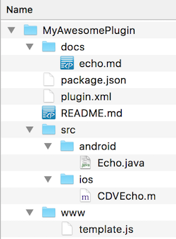

_approximate duration : 15 minutes_

## Plugin Creation Tools

- The [phonegap-plugin-template](https://github.com/phonegap/phonegap-plugin-template) tool makes it easy to create a new plugin by scaffolding a plugin project template for you.

    1. If you haven't already installed this tool, do so now with the following command:

        `$ npm install -g phonegap/phonegap-plugin-template`

    2. To create a new plugin project, type the following command, specifying your desired a file path, plugin name and id 

        `$ phonegap-plugin-create PATH NAME ID`

        For example: 

        `$ phonegap-plugin-create ~/MyNewPlugin MyNewPlugin org.mycompany.myplugin`

## Plugin Project Structure 

Once you create your plugin project using the **phonegap-plugin-template** tool, you can `cd` into the new project and you will see a structure that looks like the following:

You can open each file in your favorite editor and start modifying with the relevant parts for your plugin. In the next few sections we'll cover each of the pieces that make up a plugin. 

## Plugin XML Definition

Plugins are defined using a top-level file named `plugin.xml` within your plugin project. Open the `plugin.xml` file created in your template project and note the sections described below. 

- **Plugin Metadata** - the attributes defined on the plugin element are the `id` and `version` with the 1st child element defining the plugin name.   

      <plugin xmlns="http://cordova.apache.org/ns/plugins/1.0"
            id="org.devgirl.testplugin" version="0.0.1">
      <name>MyAwesomePlugin</name>

- **JavaScript code** - the JavaScript interface is defined in the `<js-module>` element. This is the interface called by the app developer to invoke the native platform code for the plugin. The name specified in the target is used to access the plugin functions from your Cordova app (ie: `Template.echo()`)

      <js-module src="www/template.js" name="Template">
          <clobbers target="Template" />
      </js-module>

- **Platform Code Definition** - a `<platform`> element is defined for each platform supported by a plugin. The `<feature>` element specifies the name to use for the plugin service and maps it to the
  class name for each platform. In the case of Android it will need to be prefixed with the package id as shown below. This mapping is used to 
  locate the code to run when the service is called. 

  **Android**  

      <platform name="android">
          <config-file target="res/xml/config.xml" parent="/*">
              <feature name="Echo" >
                  <param name="android-package" value="org.apache.cordova.test.Echo"/>
              </feature>
          </config-file>
          <source-file src="src/android/Echo.java" target-dir="src/org/apache/cordova/test" />
      </platform>

  **iOS**  

      <platform name="ios">
        <config-file target="config.xml" parent="/*">
            <feature name="Echo">
                <param name="ios-package" value="CDVEcho"/>
            </feature>
        </config-file>
        <source-file src="src/ios/CDVEcho.m"/>
      </platform>

- **Dependencies** - the `<dependency>` tag allows you to specify other plugins on which the current plugin depends. The plugins are referenced by their unique npm ids or by github url.

      <dependency id="cordova-plugin-someplugin" url="https://github.com/myuser/someplugin" />
      <dependency id="cordova-plugin-someplugin" version="1.0.1">

>See [the cordova-plugin-file-transfer plugin](https://github.com/apache/cordova-plugin-file-transfer/blob/master/plugin.xml) for an example

### Exercise 2

1. Create a plugin 
2. Add dependencies to two additional plugins
3. Add your new plugin to a PhoneGap or Cordova app project 

>Tip: Use the --link flag when you add the plugin locally during developmet and Cordova will create a symbolic link to it. This way any source updates will automatically be available to your project. 

        `$ cordova plugin add --link ~/path/to/plugin`

<!-- Add plugin validation? -->

<a href="lesson1.html" class="btn btn-default"><i class="glyphicon glyphicon-chevron-left"></i> Previous</a>
<a href="lesson3.html" class="btn btn-default pull-right">Next <i class="glyphicon
glyphicon-chevron-right"></i></a>

