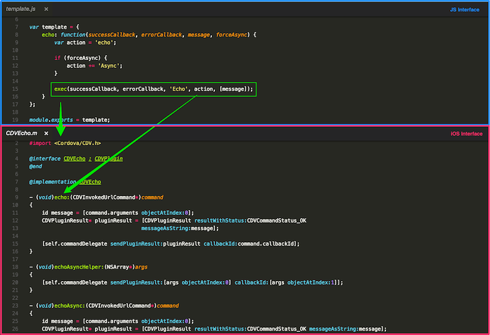
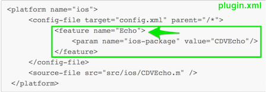
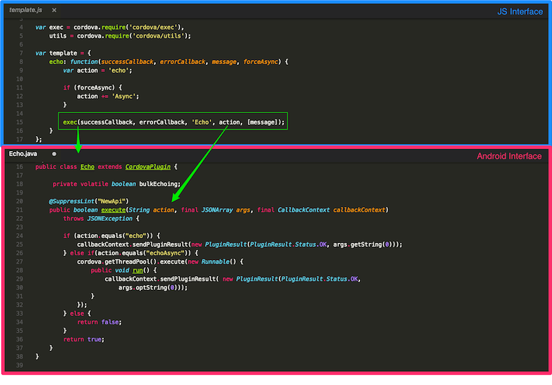
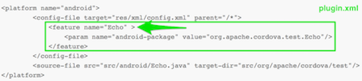

<!--_approximate duration : 15 minutes_-->

## Plugin Components
A plugin is made up of the following components:

1. A **JavaScript interface** (called by plugin consumers)

1. A **native interface** for each supported platform ie: Obj-C / Swift, Java, C# (called from JavaScript interface)

1. A built-in **Cordova bridge** that provides:

   - plumbing to *map the JavaScript arguments* to the native interfaces
   - callback handling to ensure the native code routes back the result to the proper callback depending on success or failure

## JavaScript Bridge
The `exec()` function is used by Cordova to call the native interface and pass the required parameters

    cordova.exec(successCallback(result) {}, // Function to call on success
                 failCallback(error) {},     // Function to call on error
                 serviceName,                // Service
                 actionName,                 // Action to invoke in service
                 ["firstArg", "secondArg", 42, false]); // Array of opt. args

 

## Cordova Bridge Mapping for iOS

#### Notes
1. Cordova will locate the ios platform interface class matching `Echo` (based on **plugin.xml** mapping, in this case `CDVEcho`)
1. Cordova will look for a *method* matching `echo` (or `echoAsync`) in the ios plugin interface and call it, passing in an object containing the necessary parameters and callback info
1. The `command` argument contains references to the parameters that are sent from JavaScript (`message`) and the callbacks
1. The `pluginResult` object is created with a status and any other data it needs to return. The `CDVCommandStatus` parameter defines whether the plug-in call was successful or not so the proper callback is invoked.
1. the `sendPluginResult()` method returns the plugin result back to JavaScript (invoking the callback)

>The `plugin.xml` defines the mapping for the service name to the native ios class

## Cordova Bridge Mapping for Android

#### Notes
1. Cordova will locate the android platform interface class matching `Echo` (based on **plugin.xml** mapping)
1. Cordova will locate the `execute()` method in the android plugin code and pass in the `action` value and the rest of the parameters in the order shown above
1. The `args` array contains references to the parameters sent from JavaScript (`message`)
1. The `callbackContext` contains the callback function info
1. The `PluginResult` object is created with data retrieved from JavaScript. The `PluginResult.Status.*` parameter defines whether the plug-in call was successful or not to call the right callback function.
1. The `sendPluginResult()` method returns the plugin result back to JavaScript (invoking the callback)

>The `plugin.xml` defines the mapping for the service name to the native android class

<!--
### Visual Example
The picture below illustrates how the JavaScript common interface specifically maps to each native Class:-->

<!--
### Exercise
Open the JavaScript interface for your plugin (in `www/template.js`) and find the `exec()` function, then open each of the native
interfaces (in `src/ios` and `src/android`) and notice how the parameters are mapped for each:

    echo: function(successCallback, errorCallback, message, forceAsync) {
        var action = 'echo';
        if (forceAsync) {
            action += 'Async';
        }
        exec(successCallback, errorCallback, 'Echo', action, [message]);
    }-->

<!-- 
- The first and second parameters are the _success_ and _error_ callback functions
- The third parameter calls the `Echo` service in the native platform for the plugin
- The fourth parameter requests the _action_ to execute (`echo`) within the service class.
- The last specifies an array of arguments to pass to the `echo()` method. In this case it's just a _string_ -->

<!--
###### plugin.xml snippet
 
-->

### Resources
Check out the official [Apache Cordova Plugin Development Guide](http://cordova.apache.org/docs/en/latest/guide/hybrid/plugins/index.html) for more details on all of the above. 

<a href="lesson2.html" class="btn btn-default"><i class="glyphicon glyphicon-chevron-left"></i> Previous</a>
<a href="lesson4.html" class="btn btn-default pull-right">Next <i class="glyphicon
glyphicon-chevron-right"></i></a>

