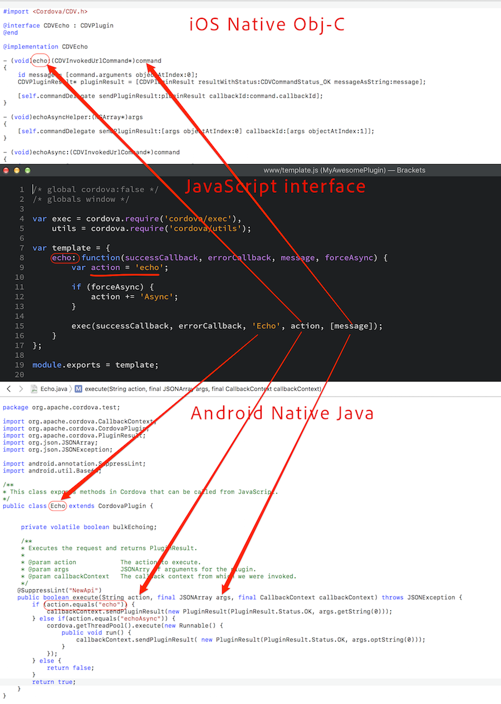
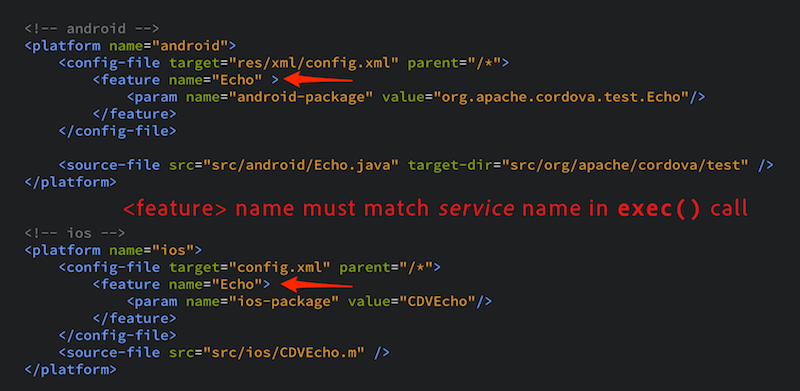

_approximate duration : 20 minutes_

## Plugin Components
To review, a plugin is made up of the following components:

1. A **JavaScript interface** - _what developers call_

1. A **native interface** written in ObjC, Swift, Java or C# for each supported platform - _where the work is done_

1. Built-in **Cordova bridge** that provides:
  - the plumbing to get your JavaScript arguments mapped to the native interfaces
  - the callbacks to ensure the native code is run asynchronously

## Plugin Workflow

The `cordova exec` function is used to call the native interface and pass the required parameters to invoke the native interface with optional arguments needed. 

    cordova.exec(successCallback, // function to call with results on success
             errorCallback,   // function to call with error
             strClassName,    // String name of Class in native code
             strMethodName,   // String name of function
             ["a","b",... ] ); // array of string args, possibly empty

<!-- App developer provided *callback* functions -->

#### Cordova Bridge Mapping for iOS

1. Cordova will look for a Cordova plugin interface matching `strClassName`
1. Cordova will look for a method matching `strMethodName` in the ios plugin code and call it, passing in an object which 
contains the arguments as well as a `callback_id` which can be used to signal success of failure.  This `callback_id` will then be routed to the correct callback.

   **Example class signature** 
   `- (void)strMethodName:(CDVInvokedUrlCommand*)command {...}`

#### Cordova Bridge Mapping for Android

1. Cordova will look for the Cordova plugin interface matching `strClassName`
1. Cordova will call the `execute` method in the android plugin code and pass an action of `strMethodName` with optional arguments

   **Example class signature**  
   `public boolean execute(String action, JSONArray args, CallbackContext callbackContext) throws JSONException {...}`

### Visual Example
The picture below illustrates how the JavaScript interface specifically maps to each native Class:

### Exercise 4

Open the plugin created in the previous step and `exec` function. Notice the arguments passed to it:
    <!--
    echo: function(successCallback, errorCallback, message, forceAsync) {
        var action = 'echo';
        if (forceAsync) {
            action += 'Async';
        }
        exec(successCallback, errorCallback, 'Echo', action, [message]);
    }-->

- The first and second parameters are the success and error callback functions
- The first parameter calls the `Echo` _service_, a **Class** name
- The second requests the `echo` _action_, a **method** within that class
- The third is an array of arguments containing the echo _string_, which is the `echo` method's first parameter.

Also, note that in the `plugin.xml` feature definition within each platform, the name matches the name passed in as the _service_ name.

<!--## Demo - Data Passing
TODO: are we showing this plugin - https://github.com/purplecabbage/phonegap-plugin-sidebar -->

### Bonus Exercise 

Update your plugin code to pass additional data round trip using the information learned thus far. 

<a href="lesson2.html" class="btn btn-default"><i class="glyphicon glyphicon-chevron-left"></i> Previous</a>
<a href="lesson4.html" class="btn btn-default pull-right">Next <i class="glyphicon
glyphicon-chevron-right"></i></a>

