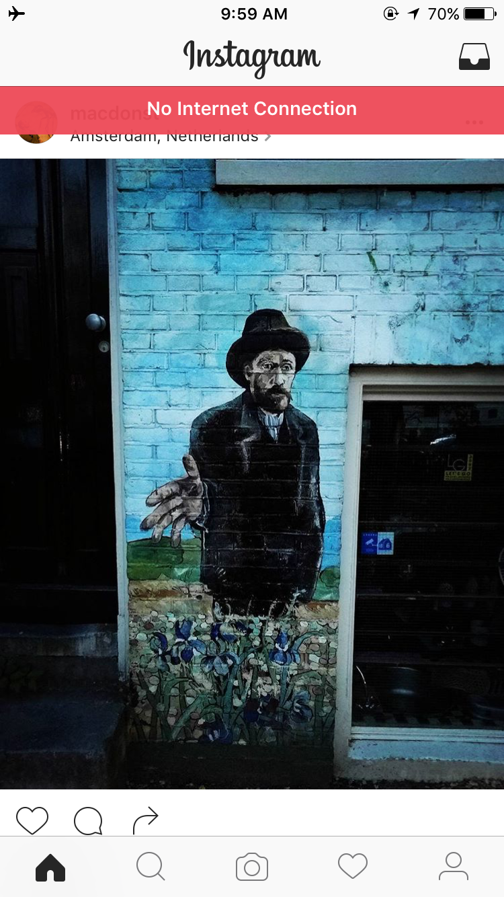
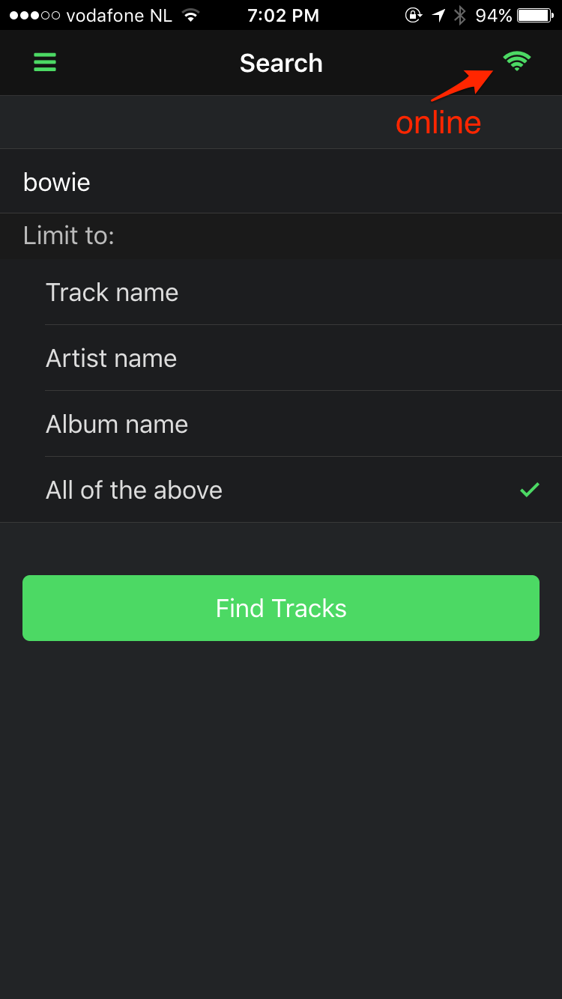
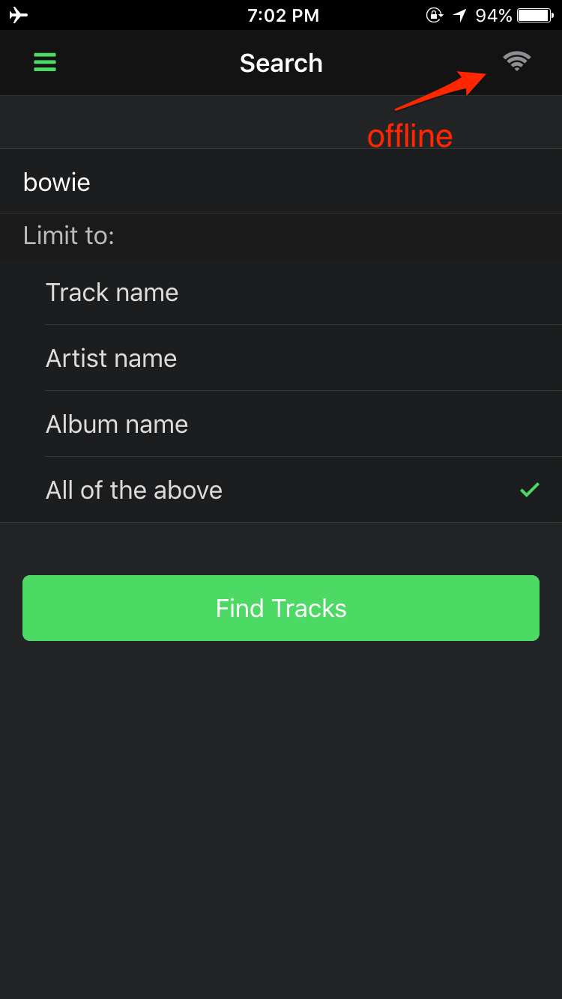
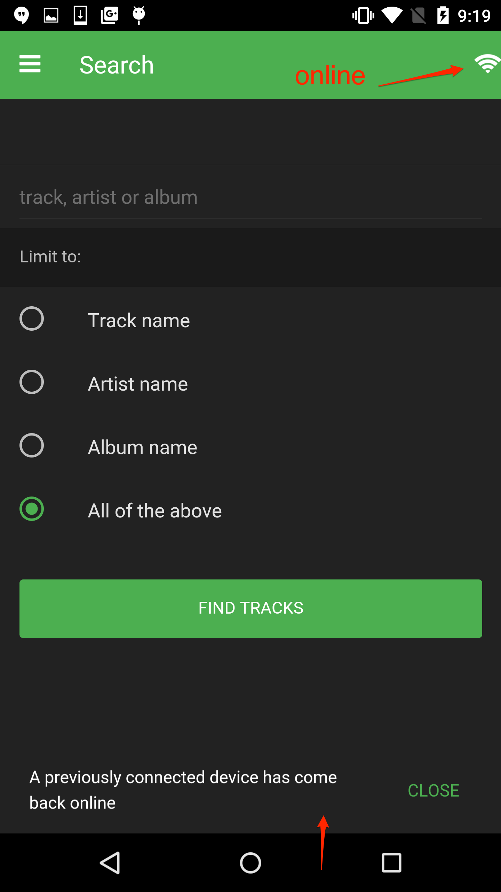
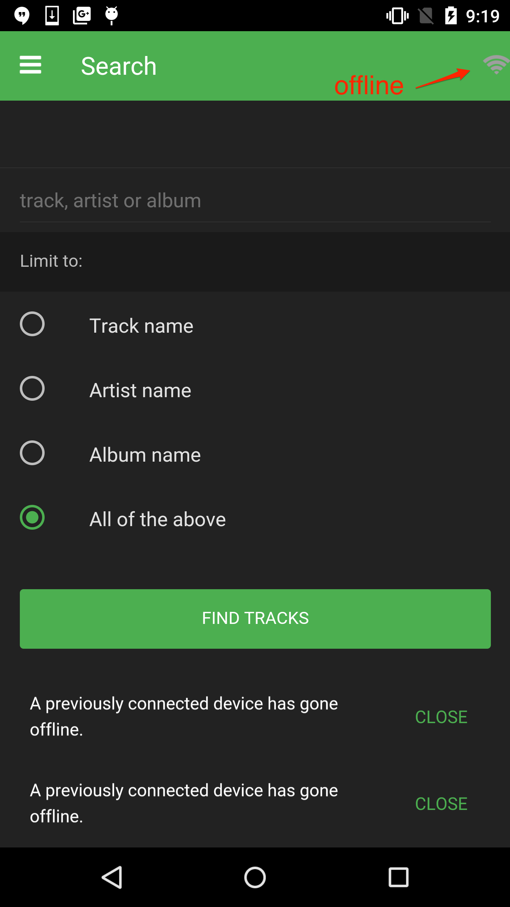
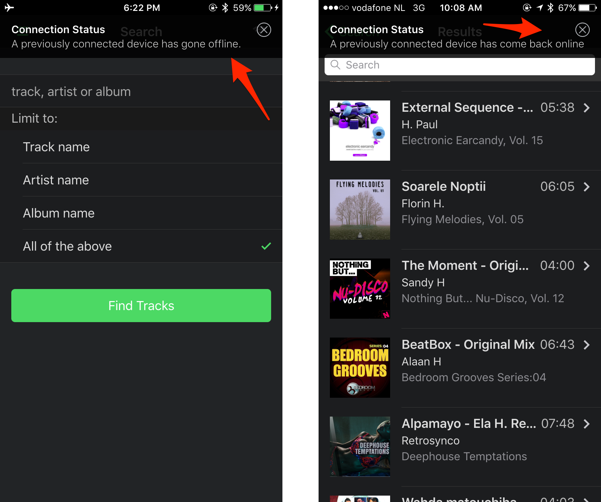

## Overview
When building for mobile you should always take an offline-first approach. There will be times when the 
user has no network connectivity and their experience shouldn’t suffer as a result.
The Apple app store actually tests to ensure that you are handling an offline scenario when you submit your apps for review.

For example, Instagram notifies the user there's no internet connection while you're in the app using a notification
at the top of the screen:

 
 

When building PhoneGap apps you can easily check the current status of the connection using the [Cordova Network Information Plugin](https://github.com/apache/cordova-plugin-network-information). You can also setup event listeners to be notified when the 
connection goes from online to offline and vice versa and take action then accordingly. 

In this lesson you will learn how to use this plugin to detect and listen for network changes and pop up a toast
notification to the user. 

## Requirements
Before you can code this feature, you'll first need to add the [Cordova Network Information Plugin](https://github.com/apache/cordova-plugin-network-information) to your project since it is not yet used in the Star Track base
app template. 

1. Open your terminal and use the PhoneGap CLI to add it now (the `--save` parameter will save the plugin to your `config.xml` file): 

       phonegap plugin add cordova-plugin-network-information --save

   >Be sure to visit the [Cordova Network Information Plugin Docs](https://github.com/apache/cordova-plugin-network-information) to learn about any platform quirks and more things you can do 
  with this plugin.

## Steps
- Open `www/index.html` and add a wifi icon to the `index` page `navbar` on the right side to indicate 
the current connection status. [Font Awesome](http://fontawesome.io/icons/) is already included in the project and has an icon you can use
with the name `fa-wifi`.

  First locate the `navbar` defined for the `index` page in the `www/index.html` file. You can search for `navbar` and find the one
  with the attribute `data-page="index"`. Add the right side definition as shown in the snippet below. (The whole navbar definition is
  included for easier reference). 
  
    
        

        

            

                <!--
                    Left link contains only icon - additional "icon-only" class
                    Additional "open-panel" class tells app to open panel when we click on this link
                -->
                <a href="#" class="link icon-only open-panel"><i class="fa fa-bars"></i></a>
            

            
Search

            <!-- Workshop - Add right navbar icon -->
            

                <!--
                    Right icon indicates network connection status               
                -->
                <a href="#" class="icon-only"><i class="fa fa-wifi"></i></a>
            

        

        
    
        
      
   The icon doesn't actually do anything meaningful yet but we'll add handling to change the color of it to
   indicate online/offline status. 

   >Note that due to platform styling differences, we're using different colors between the platforms to indicate
   online and offline (green/gray on iOS, white,gray on Android).       

   
   
     
   
   
   
  
- Now open the `www/js/my-app.js` file and add the following variable declaration to the top of the file under the `isIos`
and `isMaterial` handling. This will keep the current network status in case we need to check it in other parts of the code.
We'll begin by assuming it's offline until the next step can determine it for sure. 

       var offline = true;

- While still in the `www/js/my-app.js` file, add the following code to the `deviceready()` function.

  This code checks to ensure the plugin is available and then checks if the current 
  connection is none, indicating it would be offline. In this case it will set the color to gray on both
  platforms. It then adds event listeners to the `offline` and `online` events to listen for a change in 
  status to allow for further handling in those scenarios.
  
      
        if (navigator.connection && navigator.connection.type == Connection.NONE) {
            $$('.fa-wifi').addClass('color-gray');     
        }
        else {
            // It's connected, set a flag and icon colors
            offline = false;
            if (isIos) $$('.fa-wifi').addClass('color-green');
            else $$('.fa-wifi').addClass('color-white');
        }
        
        document.addEventListener("offline", onOffline, false);
        document.addEventListener("online", onOnline, false);
 
    
  >You should always ensure you wait until the `deviceready` event is fired before using any Cordova native plugins.   

- Next we'll add the functions for the `onOffline` and `onOnline` handlers. They will both display
a toast style notification to indicate the status change and set the colors of the wifi icon on the main
page for visual notification. (See the [Framework7 notification docs](http://framework7.io/docs/notifications.html) 
for more details on using these toast style notifications in your apps).    

   - Add the function for the `onOffline` handler just below the `deviceready` function:     
   
            function onOffline() {
                offline = true;
                myApp.addNotification({
                   title: 'Connection Status',
                   message: 'A previously connected device has gone offline.'
                });
                if (isIos) $$('.fa-wifi').removeClass('color-green').addClass('color-gray');
                   else $$('.fa-wifi').removeClass('color-white').addClass('color-gray');            
            }

  - Add the function for the `onOnline` handler just below the above:

            function onOnline() {
                // Show a toast notification to indicate the change
                myApp.addNotification({
                    title: 'Connection Status',
                    message: 'A previously connected device has come back online'
                });
                // Set the wifi icon colors to reflect the change
                if (isIos) $$('.fa-wifi').removeClass('color-gray').addClass('color-green');
                else $$('.fa-wifi').removeClass('color-gray').addClass('color-white');    
                offline = false;
            }
    
## Run it
The end result should look like the following where you see a notification displayed when you go offline and
online. 

   
  
## Extra Credit
Requiring users to have to close the notifications is less than ideal. Instead, check out the additional parameters available
in Framework7 notifications that could help make it a better experience. 
  
>At this point you could further handle the experience as desired. You may want to store some data in local storage
or another on-device database to allow them to use the app with the cached data. Your app may also have data
that needs to be saved off to be synced to a server when you're back online. The goal is to provide the most
optimal user experience.  

<a href="lesson2.html" class="btn btn-default"><i class="glyphicon glyphicon-chevron-left"></i> Previous</a>
<a href="lesson4.html" class="btn btn-default pull-right">Next <i class="glyphicon
glyphicon-chevron-right"></i></a>

