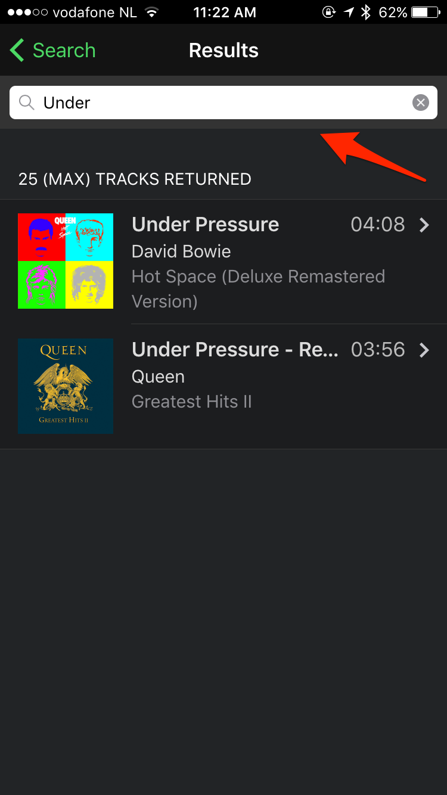
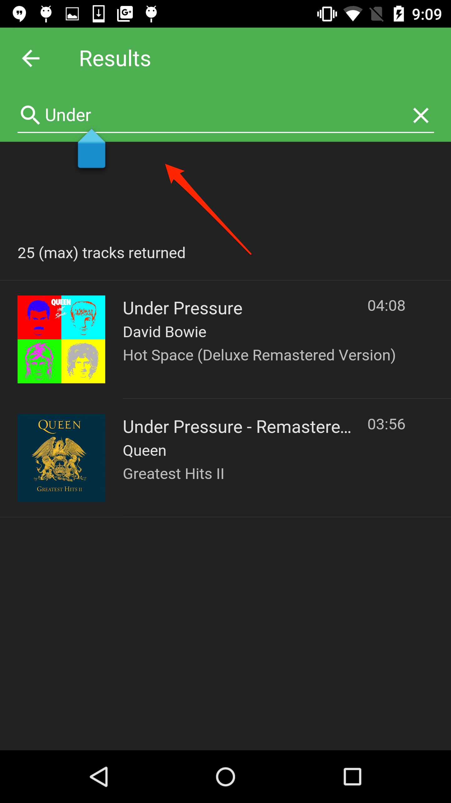
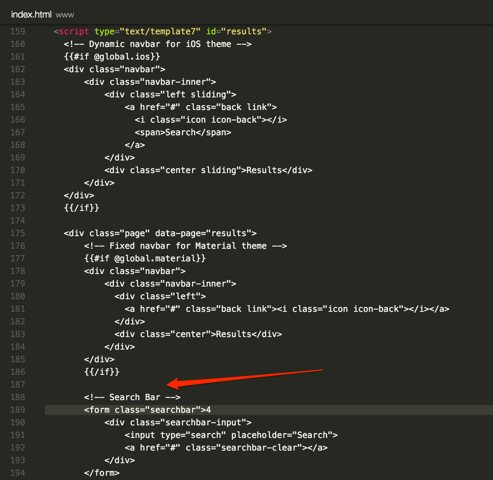

_approximate duration : time permitting_

## Apache Cordova Plugin Testing

## PhoneGap Plugin Testing

## Testing tools

_tools to help you, paramedic, jasmine, jshint_

## Demo

_paramedic running tests against a plugin_

## Exercise: 

> write and run some simple tests for a plugin

<!--In this step we'll add a [Framework7 Searchbar]((http://framework7.io/docs/searchbar.html) component to our results page to allow the user to search/filter the results with a matching string
entered by the user. This component is used to filter results *after* they are received. 

Below is the result on iOS and Android respectively:

   
   
    
## Steps
1. Begin by opening your browser and reviewing the [Framework7 documentation](http://framework7.io/docs/searchbar.html) for the `searchbar` component.
1. Open `www/index.html` and locate this `results` template script tag since we'll be adding this new component to that page:
            ```
            <script type="text/template7" id="results">
            ```

2. The `searchbar` needs to be placed somewhere within a `.page` class and just before a `.page-content` class. In the results template, locate the `<div>` with the `.page` class and associated `.navbar`. 
Insert the following `searchbar` `<form>` element which contains an input field with a `clear` button just 
before the `<div>` with the `.page-content` class as shown in the image directly below it:

          <form class="searchbar">
              <div class="searchbar-input">
                  <input type="search" placeholder="Search">
                  <a href="#" class="searchbar-clear"></a>
              </div>      
          </form>

   

2. Next, open the `www/js/myApp.js` file and add the following code block just above the `myApp.onPageInit('details', function(page) {..}))` function. 
This new function will run when the `results` page initializes and will initialize the `searchbar` component
with the parameters shown. Each of these parameters is set to a class name that you will apply in the HTML
elements to mark the elements that should be used for each scenario (what list to search, what data to search, 
what to display when found and not found etc): 

       myApp.onPageInit('results', function(page) {
           var mySearchbar = myApp.searchbar('.searchbar', {
               searchList: '.list-block-search',
               searchIn: '.item-content',
               found: '.searchbar-found',
               notFound: 'searchbar-not-found'
           })
       })   
       
       
   **Parameters**<br>
   
    - searchList - the class selector for the list containing the data to search
    - searchIn - set to the class selector for the content to be searched. Defaults to `.item-title` otherwise.
    - found - the class selector for the element or block to display with the matches found
    - notFound - the class selector for the element to display in the case where no matches were found
   
    >These parameters can also be initialized inline the HTML with `data-*` attributes. 
  See the [Framework7 docs on Pages](http://framework7.io/docs/pages.html) to learn more about the events that can be handled for a page.

3. Now go back into `www/index.html`  and add the `searchbar-found` class to the `<div>` element containing 
the list block, since it will create a filtered list using those same elements with the matched items:

        <div class="list-block media-list list-block-search searchbar-found">
        
4. Next add a new `<div>` element to show a message when no results are found, ensuring you specify the same class name you set in the 
searchbar init function. Add this new `<div>` just after the searchbar form (class name is 'searchbar-not-found' in this case).

        <div class="content-block searchbar-not-found">
               No matches found
        </div>

2. Lastly, add a new `<div>` element with the `searchbar-overlay` class to enable a dark overlay effect for the page content when the search bar is active. 
Add it just after the `searchbar-not-found` `<div>` added above.

        <div class="searchbar-overlay"></div>

-->

<div class="row" style="margin-top:40px;">
<div class="col-sm-12">
<a href="lesson3.html" class="btn btn-default"><i class="glyphicon glyphicon-chevron-left"></i> Previous</a>
<a href="lesson5.html" class="btn btn-default pull-right">Next <i class="glyphicon
glyphicon-chevron-right"></i></a>
</div>
</div>
