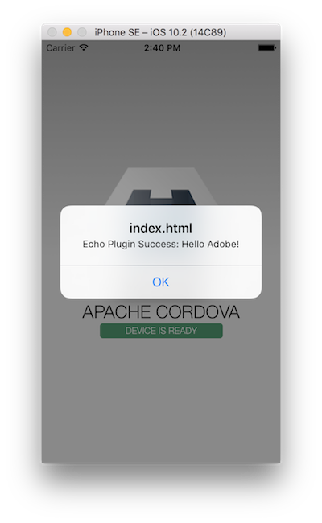

<!--_approximate duration : 15 minutes_-->

## Plugin XML Definition

Plugins are defined using a top-level metadata file named `plugin.xml` within the plugin project. Note the following sections:

- **Plugin Metadata**

  The attributes defined on the root plugin element are the `id` and `version` ([semver](http://semver.org/) syntax) with the 1st child element defining the plugin name.   

      <plugin xmlns="http://cordova.apache.org/ns/plugins/1.0"
            id="my-echo-plugin" version="0.0.1">
      <name>myechoplugin</name>

  Some other metadata tags you could specify are `<description>`, `<author>` etc. Check out the official [plugin.xml specification](http://cordova.apache.org/docs/en/latest/plugin_ref/spec.html) for a complete list of supported values.

- **JavaScript Interface Defintion**

  The JavaScript interface is defined in the `<js-module>` element with the target `src` file and a `name` to refer to it (if you needed to specify it in a `cordova.require` to import it. It's referred to with the name specified here and qualified by the plugin id - ie: `my-echo-plugin.Template`

    The `<clobbers>` element specifies the target name to make available on the global `window` object.This is the name used by Cordova app developers when they call your plugin (ie: `Template.<function-name>` or in the case of the [Cordova contacts plugin](https://github.com/apache/cordova-plugin-contacts) `navigator.contacts.find`)

      <js-module src="www/template.js" name="Template">
          <clobbers target="Template" />
      </js-module>

   >You will need a `<js-module>` element for each JavaScript file needed in your interface. Cordova uses this to automatically inject the `<script>` tag so the app developer doesn't need to worry about it.

- **Platform Interface Definitions**

  A `<platform`> element is defined for each platform supported by a plugin. The `<feature>` tag within the `<config-file>` specifies the `name` to use as the plugin ***service***, which is called as a parameter from the JavaScript interface. The `value` sets the name of the
  native class to map the *service* call to. 
  
  >This tag is injected into the platform-specific `config.xml` file to make the platform aware of the additional code library. In the case of Android it will need to be prefixed with the package id as shown below.

  **Android**  

      <platform name="android">
          <config-file target="res/xml/config.xml" parent="/*">
              <feature name="Echo">
                  <param name="android-package" value="org.apache.cordova.test.Echo"/>
              </feature>
          </config-file>
          <source-file src="src/android/Echo.java" target-dir="src/org/apache/cordova/test" />
      </platform>

  **iOS**  

      <platform name="ios">
        <config-file target="config.xml" parent="/*">
            <feature name="Echo">
                <param name="ios-package" value="CDVEcho"/>
            </feature>
        </config-file>
        <source-file src="src/ios/CDVEcho.m"/>
      </platform>

- **Dependencies**

  The `<dependency>` tag allows you to specify other plugins your plugin depends on. The plugins are referenced by their unique **npm ids** or by **github url**.

      <dependency id="cordova-plugin-someplugin" url="https://github.com/myuser/someplugin"/>
      <dependency id="cordova-plugin-someplugin" version="1.0.1">

  >See [the cordova-plugin-file-transfer plugin](https://github.com/apache/cordova-plugin-file-transfer/blob/master/plugin.xml) for an example

### Exercise
1. Update your Cordova app to invoke your plugin's `echo()` function

    **Hint:**
   `Template.echo(function(result){alert("Success: " +result)},function(e){alert("Fail " + e)},"Helloooo Adobe!",true)`

2. Build and run your app

    $ cordova run ios

### Extra Credit
Update your plugin signature to pass additional parameters and code handling on the native side for them using the information learned thus far.

### Extra Extra Credit :)
Update your plugin to add an additional action other than `echo` for the plugin consumer to call. Use the information learned above and existing plugins as references to 
implement the handling all the way through to the native side for each platform. 

An example might be to add a `notify` type of action to call and display a native notification for each platform. 

### Resources
Be sure to use the official [plugin.xml specification](http://cordova.apache.org/docs/en/latest/plugin_ref/spec.html) for a complete list of supported values. The [Cordova Plugin Development Guide](http://cordova.apache.org/docs/en/latest/guide/hybrid/plugins/index.html) 
can also be used to further your knowledge on all of the above.

>**TIP:** Check out the [Cordova Contacts plugin](https://github.com/apache/cordova-plugin-contacts/blob/master/plugin.xml) for a great example of a more complex plugin definition.

<!--## Demo - Data Passing
TODO: are we showing this plugin - https://github.com/purplecabbage/phonegap-plugin-sidebar -->

<a href="lesson3.html" class="btn btn-default"><i class="glyphicon glyphicon-chevron-left"></i> Previous</a>
<a href="lesson5.html" class="btn btn-default pull-right">Next <i class="glyphicon
glyphicon-chevron-right"></i></a>

