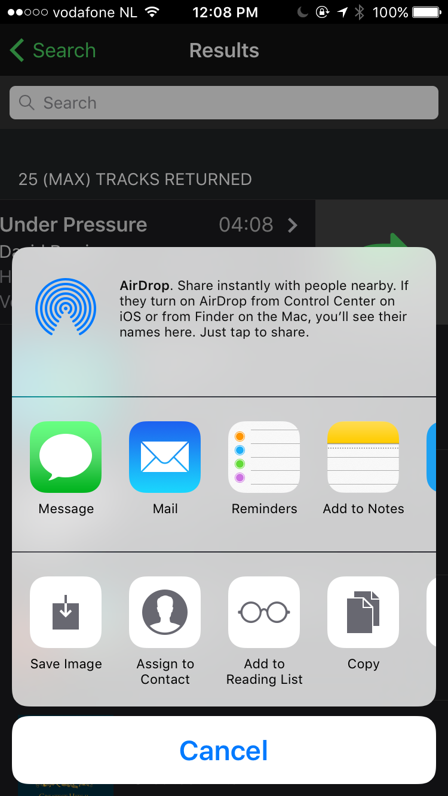
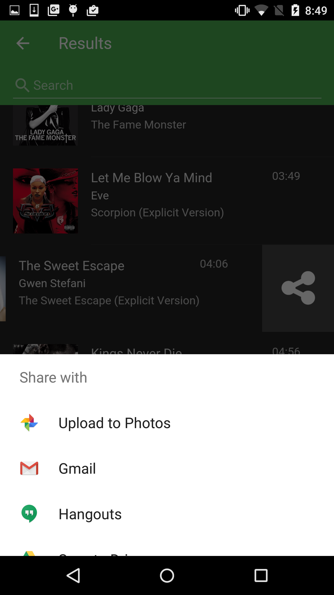

In this module we'll learn how to share a media item with a friend through messaging, email etc using the device's native sharing features.

## Requirements
Before you can add code to support this feature, you'll first need to add the [Social Sharing Plugin](https://github.com/EddyVerbruggen/SocialSharing-PhoneGap-Plugin)
to your project since it is not yet used in the Star Track base app template. 

1. Open your terminal and use the PhoneGap CLI to add it now (the `--save` parameter will save the plugin to your `config.xml` file): 

       phonegap plugin add cordova-plugin-x-socialsharing --save

>Be sure to visit the [Social Sharing Plugin Docs](https://github.com/EddyVerbruggen/SocialSharing-PhoneGap-Plugin) 
to learn about any platform quirks and more things you can do with this plugin. This plugin and many other 
great plugins were written by Eddy Verbruggen and can be found on his [GitHub repo](https://github.com/EddyVerbruggen).  

## Steps
Prior to this step we added a `swipeout` action to the results view with a share button though it doesn't actually do anything yet. 
In this module we'll add event handling to this button to trigger the Social Sharing plugin functions. 

1. Open `www/js/my-app.js` and locate the page init event handler for the *results* page (`myApp.onPageInit('results')...`).
 
2. Add the following code to handle when a user clicks the *share* button on the swipeout. You can add it just after the  `searchbar` init handling:

        $$(page.container).find('.share').on('click', function (e) {
            var item = page.context.tracks.items[this.dataset.item]

            if (window.plugins && window.plugins.socialsharing) {
                window.plugins.socialsharing.share("Hey! I found this on Spotify. It's called " + item.name + ", check it out!",
                    'Check this out', item.album.images[2].url, item.preview_url,
                    function () {
                        console.log("Share Success")
                    },
                    function (error) {
                        console.log("Share fail " + error)
                    });
            }
            else myApp.alert("Share plugin not found");
        });

## Try it! 
Try out the button now to make sure you see the share features for your native device (or a message stating the plugin is 
not supported). Remember, this is a 3rd party plugin so you can only test this feature if you're running from the CLI locally.

  It should look something like below when you run it on iOS:

  
  
    
  
  
  
  >The options shown in the share menu will depend on your particular devices' native sharing options.

 

 <a href="lesson5.html" class="btn btn-default"><i class="glyphicon glyphicon-chevron-left"></i> Previous</a>
 <a href="lesson7.html" class="btn btn-default pull-right">Next <i class="glyphicon glyphicon-chevron-right"></i></a>
 

