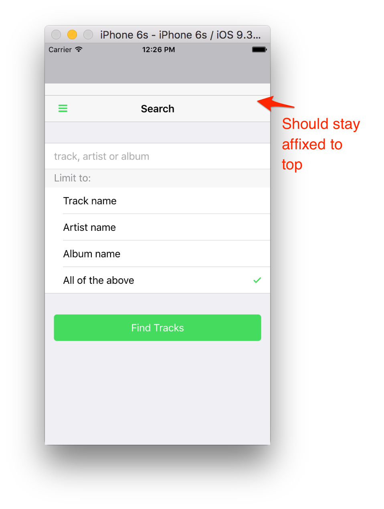

### Overview
You can configure your app with specific preferences and settings depending on the type of app you're building. In this module we'll look at some popular preferences and settings you should be aware of when building your apps.

#### Common Preferences
1. **DisallowOverscroll** (iOS)

   By default the webview will have a bounce effect on iOS. You can see it when you try to drag down from the navigation bar, it will actually allow you to pull it down and snap back up when you stop:

    

   Normally you would want your nav bar and toolbars to stay fixed though, so typically
   you'll want to disable this effect in your apps. Set this property to true in your config.xml:

        <preference name="DisallowOverscroll" value="true" />

  > If you try to set this to false you will see the bounce effect but only when you're running on an iOS
  device directly outside of the PhoneGap Developer App since the PhoneGap Developer app has it configured
  to true in the wrapper config.xml.       

2. **iOS Backup Storage** (defaults to iCloud)

        <preference name="BackupWebStorage" value="none" />

3. **Orientation** (iOS)

         <preference name="Orientation" value="all" />

3. Specifying intents to allow
- **ios**

         <allow-intent href="itms:*" />
         <allow-intent href="itms-apps:*" />

    - **android**
         <allow-intent href="market:*" />

>All of these settings are already included in your base template project so no action is required.

4. Content Security Policy
The CSP is used to help secure your app and mitigate injections and vulnerabilities like cross-site scripting (XSS). You can customize it to
whitelist approved sites amongst other things. To use it you need to ensure you have the [Cordova Whitelist Plugin](https://github.com/apache/cordova-plugin-whitelist
added to your project (already included in the base template by default) and add a meta tag to your index.html that declares the specific policy
 you want to apply for your app.

    <meta http-equiv="Content-Security-Policy" content="default-src 'self' data: gap: https://ssl.gstatic.com` `https://api.spotify.com 'unsafe-eval' 'unsafe-inline' ws://localhost:3000; 
    style-src 'self' 'unsafe-inline';` `media-src *; img-src * data:">

To learn more about how to customize the CSP specifically, check out the [Cordova Whitelist Guide](http://cordova.apache.org/docs/en/latest/guide/appdev/whitelist/index.html)
  and [Cordova Whitelist Plugin](https://github.com/apache/cordova-plugin-whitelist/blob/master/README.md#content-security-policy).  
 Also, you can get help generating your specific header to include in the meta tag more easily using this [website](http://cspisawesome.com/).

3. Icons and Splash screens - set up the paths for each platform with the different required attributes according. The icons
have already been set up in the Star Track app so you can use the `config.xml` file for ar reference. See the
[Official Cordova guides](https://cordova.apache.org/docs/en/latest/config_ref/images.html) for details. 

           <platform name="ios">
               <icon height="180" src="res/icon/ios/icon-60@3x.png" width="180" />
               <icon height="60" src="res/icon/ios/icon-60.png" width="60" />
               <icon height="120" src="res/icon/ios/icon-60@2x.png" width="120" />      
               ...
           </platform>
           <platform name="android">
               <preference name="android-minSdkVersion" value="14" />
               <icon density="ldpi" src="res/icon/android/ldpi/icon.png" />
               <icon density="mdpi" src="res/icon/android/mdpi/icon.png" />
               ...
           </platform>

 >All of the above settings are already included in the base template project so no action is required.

#### General Icon Support
1. Copy the `icon.png` file from the final project `www` folder into your project `www` folder. This will be the general icon to be used for the app (on home screens) and is displayed
in PhoneGap Desktop.

2. Now open the `config.xml` file and update the icon element to reference it. The current default from the template is `logo.png`. If it's not there at all yet for some reason, add it just
after the `<content>` element.

        <icon src="www/icon.png" />

### Bonus: Platform-Specific Icon Configuration
The above is fine while testing but when you're ready to actually build and package your app for submission you'll want to know how to
configure all the different sizes needed specifically per platform. (This will vary depending on platform and version, use this as a general guideline
and see the official iOS/Android/MS docs for the latest details.

The Ionic Framework has a great service called [Ionic Resources](http://blog.ionic.io/automating-icons-and-splash-screens/) to make this process easy. You need to provide an image for an icon
with a size of 192x192 and another for the splash screen with a size of 2208x2208. Ionic provides Photoshop templates you can use as well.
See [this post](http://blog.ionic.io/automating-icons-and-splash-screens/) for more details on using their tool.

1. An icon and splash screen are included at the proper sizes in a *resources* folder in the project root starting with this module going forward. You can
use them to run `ionic resources` and they will generate all the icons and splash screen file sizes for you and add them to the config.xml file.
Once the CLI is used to do a build locally (for instance when you're ready to move towards production), then
these assets will all be copied down to their respective platform locations for you by having them included here.

    **Note:** If you're using the Android platform, Ionic also includes the following two preferences to configure the splash screen.
    Please see the [Cordova Splash Screen plugin](https://github.com/apache/cordova-plugin-splashscreen) for more details.

        <preference name="SplashScreen" value="screen"/>
        <preference name="SplashScreenDelay" value="3000"/>
        <preference name="FadeSplashScreenDuration" value="300" />

   >See the final app `config.xml` file [here](https://github.com/hollyschinsky/spotify-browser/blob/master/config.xml) to see what icons and splash screens the tool adds into the config.xml
    and all the different sizes supported.

### Plugin Dependencies
At this point it's worth going over all of the plugins this project relies on. You should always ensure they have been saved to your
 config.xml so they will be automatically installed when you decide to use the CLI to build locally and outside of the PhoneGap 
 Developer app.

        <plugin name="cordova-plugin-statusbar" spec="~1.0.1" />
        <plugin name="cordova-plugin-console" spec="~1.0.1" />
        <plugin name="cordova-plugin-whitelist" spec="~1.2.1" />
        <plugin name="cordova-plugin-media" spec="~2.1.0" />
        <plugin name="cordova-plugin-file" spec="~4.1.0" />
        <plugin name="cordova-plugin-splashscreen" spec="~3.1.0" />
        <plugin name="cordova-plugin-x-socialsharing" spec="~5.0.9" />

<a href="lesson7.html" class="btn btn-default"><i class="glyphicon glyphicon-chevron-left"></i> Previous</a>
<a href="lesson9.html" class="btn btn-default pull-right">Next <i class="glyphicon
glyphicon-chevron-right"></i></a>

